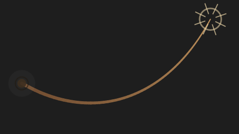
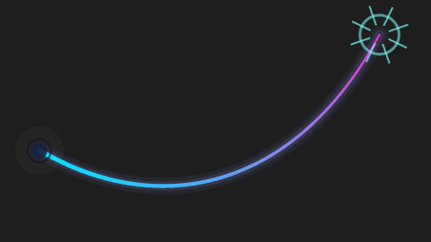
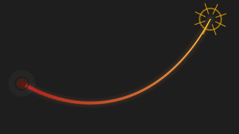
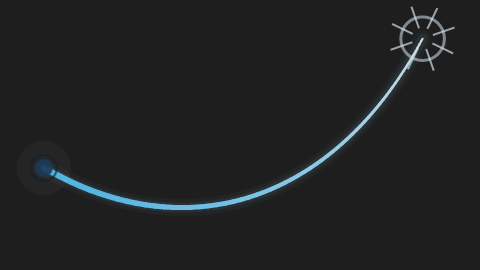
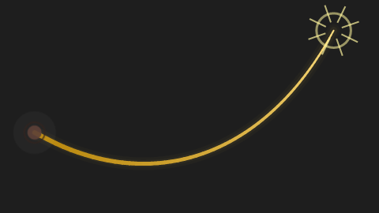
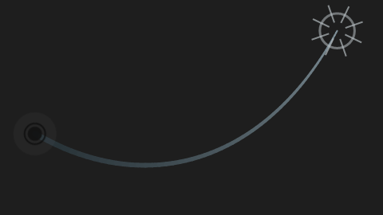

# 🪢 Virtual Whip

**English** | [Français](README.fr.md)

[](https://github.com/Toff1989/virtual-whip/actions/workflows/ci.yml)
[](LICENSE)


Is your AI thinking for too long? **Crack a virtual whip on your screen**: a sharp flick of the
mouse cracks the whip (sound + flash), interrupts the ongoing work of Claude Code or Copilot
Chat, and sends it a message telling it to hurry up. Without ever changing the focus of VS Code.

<p align="center">
  
</p>

## Features

- **A real whip on screen**: a rope simulated by a small physics engine (gravity, inertia),
  attached to an anchor point and following your cursor, within a **maximum length**.
- **Draggable anchor point**: hold the left button on the circle, move, release. The position is
  remembered.
- **Crack on gesture**: a fast enough flick of the wrist triggers the sound and the flash. A flick
  made with a mouse button held (selecting text, dragging a window) never counts, and you can ask
  for a key to be held too (`virtualWhip.gestureModifier`) if it cracks by accident.
- **Direct delivery to the AI, without touching the focus**:
  - **Claude Code terminal**: `Escape` interrupts the ongoing turn, then the message is sent;
  - **Copilot chat**: "stop and send", without stealing the focus or overwriting your draft.
- **Highly customizable**: 6 built-in styles and about fifteen settings (colors, thickness, glow,
  physics, effect, sound, behavior).
- **Light and dependency-free**: a small native Windows executable (~30 KB), no runtime to
  install. The whip is only shown while VS Code has the focus and lets every click through,
  except on the anchor point.

## Installation

Windows 10/11 and VS Code 1.93 or later.

**The easiest way**: download `install-virtual-whip.bat` from the
[Releases](https://github.com/Toff1989/virtual-whip/releases) page and double-click it. It is a
single-file installer with no prerequisite (no Node, no compiler): it installs the extension into
VS Code, VS Code Insiders and/or VSCodium, then cleans up after itself.

| Command | Effect |
|---|---|
| `install-virtual-whip.bat` | installs or updates the extension |
| `install-virtual-whip.bat uninstall` | uninstalls it |
| `install-virtual-whip.bat /s` | silent mode (no final pause) |

**Other ways**: download the `.vsix` from the Releases, then *Extensions → … → Install from
VSIX…*, or build from source (see [Development](#development)).

**Checking a download.** The overlay is a native executable that is not code-signed, so Windows
SmartScreen or an antivirus may question it. Each release therefore comes with `SHA256SUMS.txt`
and a build attestation produced by the GitHub Actions run that built it. To check a file:

```powershell
(Get-FileHash .\install-virtual-whip.bat -Algorithm SHA256).Hash   # compare with SHA256SUMS.txt
gh attestation verify .\install-virtual-whip.bat --repo Toff1989/virtual-whip
```

The executable's file properties (*Properties → Details*) name the product, its version, the
license and the address of the source code.

## Quick start

1. Restart VS Code, then click **"Whip off"** in the status bar (or press `Ctrl+Alt+F`) to show
   the whip.
2. Start Claude Code in a VS Code terminal (or open the Copilot chat and click once in its input
   box).
3. Make a **sharp flick of the mouse**: the whip cracks and the message is sent.

The built-in sound is used by default; you can pick another one (`virtualWhip.audioFilePath`).

## Customization

Open the settings (`Ctrl+,`) and search for **"virtualWhip"**: the settings are grouped into
sections. The **Virtual Whip: Choose a Style** command lists the built-in styles.

### Built-in styles (`virtualWhip.appearance.preset`)

| | | |
|:---:|:---:|:---:|
| <br>**Leather** (default) | <br>**Neon** | <br>**Fire** |
| <br>**Ice** | <br>**Gold** | <br>**Shadow** |

Every appearance setting you change **takes precedence over the style**; the ones you have not
touched follow the style. *Virtual Whip: Reset Appearance* clears everything.

```jsonc
{
  "virtualWhip.appearance.preset": "neon",
  "virtualWhip.whip.thickness": 9,       // thicker rope
  "virtualWhip.maxLength": 600,          // longer whip
  "virtualWhip.effect.color": "#ff4d94", // pink flash
  "virtualWhip.sound.volume": 60
}
```

### All settings

**General**

| Setting | Default | Purpose |
|---|---|---|
| `virtualWhip.autoStart` | `false` | shows the whip when VS Code starts |
| `virtualWhip.showOnlyWhenFocused` | `true` | hides the whip when VS Code does not have the focus |
| `virtualWhip.sensitivity` | `3.5` | minimum speed of the gesture (px/ms); higher = less sensitive |
| `virtualWhip.gestureModifier` | `none` | `ctrl` / `shift` / `alt`: a key to hold while flicking, to avoid accidental cracks |
| `virtualWhip.cooldownMs` | `650` | minimum delay between two cracks |
| `virtualWhip.maxLength` | `450` | maximum length of the whip (px) |
| `virtualWhip.anchorPosition` | `bottom-right` | starting corner of the anchor point |

**Message delivery**

| Setting | Default | Purpose |
|---|---|---|
| `virtualWhip.messages` | 6 messages | texts sent at random *(user settings only)*; left alone, the built-in messages follow the display language of VS Code |
| `virtualWhip.target` | `auto` | `auto`, `claude` or `copilot` *(user settings only)* |
| `virtualWhip.interruptBeforeSend` | `true` | interrupts the ongoing work before sending |
| `virtualWhip.interruptDelayMs` | `200` | delay between the interruption and the message (terminal) |
| `virtualWhip.reasoningEffort` | `unchanged` | `low` / `medium` / `high`: sends `/effort` to Claude Code |
| `virtualWhip.preserveTerminalDraft` | `false` | *experimental*: sets aside what you were typing in Claude Code's prompt while the message goes through *(user settings only)* |

**Whip appearance**

| Setting | Default | Purpose |
|---|---|---|
| `virtualWhip.appearance.preset` | `leather` | built-in style |
| `virtualWhip.whip.colorBase` / `colorTip` | `#785032` / `#D2A064` | gradient from base to tip |
| `virtualWhip.whip.opacity` | `0.9` | opacity (0.1 to 1) |
| `virtualWhip.whip.thickness` / `tipThickness` | `7` / `2` | thickness at the base and at the tip (px) |
| `virtualWhip.whip.glow` | `0` | glow intensity (0 to 1) |
| `virtualWhip.whip.gravity` | `0.35` | weight of the rope (0 = it floats) |
| `virtualWhip.whip.damping` | `0.985` | inertia (close to 1 = it swings for a long time) |

**Anchor point and crack effect**

| Setting | Default | Purpose |
|---|---|---|
| `virtualWhip.anchor.color` / `size` | `#3C2D1E` / `9` | color and radius of the anchor point |
| `virtualWhip.effect.enabled` | `true` | shows the flash at the tip of the whip |
| `virtualWhip.effect.color` | `#FFE6B4` | color of the flash |
| `virtualWhip.effect.size` | `1` | size of the flash (0.3 to 3) |
| `virtualWhip.effect.durationMs` | `380` | duration of the flash |
| `virtualWhip.effect.rays` | `8` | number of rays (0 = wave only) |

**Sound**

| Setting | Default | Purpose |
|---|---|---|
| `virtualWhip.audioFilePath` | empty | `.wav` or `.mp3`; empty = built-in sound; `${workspaceFolder}` accepted |
| `virtualWhip.sound.volume` | `100` | from 0 (muted) to 100 |

### Commands

| Command | Purpose |
|---|---|
| `Virtual Whip: Toggle Whip` (`Ctrl+Alt+F`) | turns the whip on or off |
| `Virtual Whip: Crack Now (test)` | triggers a crack without a gesture |
| `Virtual Whip: Choose a Style` | picks a built-in style |
| `Virtual Whip: Reset Appearance` | restores the default style and colors |
| `Virtual Whip: Reset Anchor Point Position` | puts the anchor point back in its corner |
| `Virtual Whip: Use This Terminal for Claude Code` | marks (or unmarks) the active terminal as a Claude Code terminal, for shells where it cannot be detected |
| `Virtual Whip: Diagnose Message Delivery` | writes to the *Virtual Whip* output what the extension sees: terminals, Copilot command, where a crack would go |

Changing an appearance setting, the sensitivity, the messages or the gesture key applies to the
whip on screen at once. Changing the rope length, the corner or the sound restarts it (a fraction
of a second).

## Where the message goes

| `virtualWhip.target` | Behavior |
|---|---|
| `auto` (default) | Claude Code terminal if one is detected, otherwise Copilot chat |
| `claude` | Claude Code terminal only (the active terminal if none is detected) |
| `copilot` | Copilot chat only |

- **Claude Code terminal**: detected when a `claude` command is started in it (or when the
  terminal name contains "claude"). The message is typed with `sendText`, without
  `terminal.show`, so the focus and the visible panel are left alone.
  - Detection relies on the **shell integration** of VS Code (PowerShell, bash, zsh, fish), which
    `cmd.exe` and some terminals do not have. There, run **Virtual Whip: Use This Terminal for
    Claude Code** once: the terminal is then a target for as long as it lives. If a crack goes to
    Copilot while you use Claude Code in such a terminal, the extension says so once.
  - What you were typing in Claude Code's prompt would be glued to the message.
    `virtualWhip.preserveTerminalDraft` (experimental, off by default) avoids that: it types
    Claude Code's own line-editing shortcuts to put the line aside (`Ctrl+E`, a marker, `Ctrl+U`),
    sends the message, then pastes the line back (`Ctrl+Y`) and removes the marker. Only the last
    line of a draft spanning several lines is preserved.
- **Copilot chat**: internal command `workbench.action.chat.submit` with `preserveInput` (and
  `preserveFocus`); the chat must have been clicked at least once in the window. It is not a
  public API, so a later VS Code may change it: the option names were checked against VS Code
  1.138 and, if the command fails, the extension shows the error instead of staying silent.
- **Interruption** (`virtualWhip.interruptBeforeSend`): without it, the message would be queued
  until the end of the model's turn. Terminal: `Escape` before the message (never two `Escape` less
  than 1.5 s apart, which would trigger "rewind"). Copilot: "stop and send".
- **Reasoning level** (`virtualWhip.reasoningEffort`, off by default): Claude Code terminal only.
  ⚠️ Claude Code saves this level as the model's default; `/effort auto` restores it.

## Known limitations

- **Windows only** (native transparent window, sound through the Windows multimedia API).
- The **Claude Code extension's chat panel** is not supported (its API can only prefill the input,
  not send). Enable its `claudeCode.useTerminal` setting: it then goes through a terminal, which
  the whip handles. The extension detects the panel case and tells you.
- The reasoning level does not apply to the Copilot chat (no public API).
- Copilot delivery uses an internal VS Code command (see above), and could not be tested here
  against an installed Copilot: the command's presence and signature were checked in VS Code 1.138.
- `preserveTerminalDraft` is experimental: only the sequence of keys it types was tested (against a
  simulated terminal). It has not been tried on a real Claude Code prompt, and relies on the
  editing shortcuts documented for Claude Code (`Ctrl+E`, `Ctrl+U`, `Ctrl+Y`).
- Clicking the anchor point depends on Windows: if the drag does not start, a safety net detects
  the press on the circle, but the click may then also reach the window underneath.
- The extension is not published on the Marketplace (publisher `local`), and the overlay is not
  code-signed (that needs a paid certificate): install it from the Releases, and see
  [Checking a download](#installation).

## Troubleshooting

| Symptom | Lead |
|---|---|
| Nothing is displayed | the VS Code window must have the focus (or disable `virtualWhip.showOnlyWhenFocused`); check *View → Output → Virtual Whip* |
| "overlay is not compiled" | run `npm run compile` (installation from source) |
| The whip cracks too easily | raise `virtualWhip.sensitivity` (try 6 to 8 on a large screen), or require a key with `virtualWhip.gestureModifier` |
| The message does not go through | run **Virtual Whip: Diagnose Message Delivery** and read the report in *Output → Virtual Whip*; check `virtualWhip.target`; for Copilot, click once in the chat input |
| The message goes to Copilot, not to Claude Code | the terminal has no shell integration (`cmd.exe`): run **Virtual Whip: Use This Terminal for Claude Code** in it |
| No sound | `virtualWhip.sound.volume` above 0; an `.mp3` must be playable by Windows |

## Building from source

Requirements: Windows, Node.js 20+, VS Code. The C# compiler (`csc.exe`, .NET Framework 4) is
already part of Windows.

```bash
npm ci                 # dependencies
npm run compile        # extension (TypeScript) + native overlay (C#)
npm test               # tests (appearance, settings, localization, extension, message
                       # delivery, overlay protocol and process, checksums)
```

Then press **F5** in VS Code to launch an "Extension Development Host" window with the extension.

| Script | Purpose |
|---|---|
| `npm run compile` | builds everything (also copies `VERSION.txt` into `package.json`) |
| `npm run watch` | rebuilds the TypeScript continuously |
| `npm test` | tests (`node --test`); the ones on the real overlay only run on Windows, once it is built |
| `npm run package` | builds, produces the `.vsix`, the `install-virtual-whip.bat` installer and `SHA256SUMS.txt` |
| `node scripts/make-gallery.js` | regenerates `docs/presets/*.png` and `assets/icon.png` |
| `node scripts/make-default-sound.js` | regenerates the built-in sound `assets/crack.wav` |

**Version number**: it is only written in [`VERSION.txt`](VERSION.txt). `npm run compile` copies
it into `package.json` and `package-lock.json` (required by `vsce`).

**Languages**: English is the source language; French is a translation provided through
`package.nls.fr.json` and `l10n/bundle.l10n.fr.json`. `npm test` fails if a translation is missing
or if French text appears in a file that must be English.

**Repository rules**

- `.bat` files: ASCII only and CRLF line endings. `install-virtual-whip.bat` is generated: edit
  `scripts/installer-template.bat` instead.
- The overlay is built by the system's `csc.exe`, so **C# 5 only** (no string interpolation, no `?.`).
- The focus must never change when a message is sent: no `terminal.show()`, no
  `workbench.action.chat.open`, no `output.show()` (the log only comes forward when the user
  clicks "Show Log" after *Diagnose Message Delivery*).
- `virtualWhip.messages`, `target`, `reasoningEffort` and `preserveTerminalDraft` keep the
  `application` scope (see [SECURITY.md](SECURITY.md)).
- Every setting declared in `package.json` must be listed in `src/settings.ts` as applied live, as
  needing a restart, or as read by the extension only: `npm test` fails otherwise.

```
virtual-whip/
  src/
    extension.ts        activation, status bar, commands
    settings.ts         reads the settings, detects what the user changed
    appearance.ts       built-in styles and style + settings resolution (tested)
    messages.ts         built-in messages (translated at runtime)
    messageRouter.ts    message delivery: Claude Code terminal / Copilot chat
    protocol.ts         lines exchanged with the overlay (pure functions, tested)
    sidecarManager.ts   starts, restarts and talks to the overlay
  overlay/WhipOverlay.cs    native overlay: transparent windows, physics, gesture, sound
  scripts/              overlay build, version, installer, images, sound
  test/                 unit tests
  assets/               icon and built-in sound
  l10n/                 runtime translations (French)
  docs/presets/         style previews (README)
```

The `WhipOverlay.exe --snapshot output.png` mode draws a scene into a PNG without opening any
window: it produces the previews and lets you check a style without showing anything on screen.
`WhipOverlay.exe --selftest` runs the overlay's built-in checks (gesture detection, colors, live
configuration) and exits with a non-zero code if one fails; `npm test` runs it.

### Extension ↔ overlay protocol

- Configuration: `WHIP_CONFIG` environment variable (JSON).
- stdin, one command per line: `SHOW`, `HIDE`, `CRACK`, `STATUS`, `QUIT`, and
  `CONFIG:<base64 of the UTF-8 JSON>` which applies the settings that need no restart.
- stdout: `OVERLAY_READY`, `WHIP_MESSAGE:<base64 utf-8>` on every crack,
  `WHIP_ANCHOR:<x>,<y>` when the anchor is moved (fractions 0..1 of the screen), and
  `[overlay] ...` log lines.
- If stdin closes (VS Code exits), the overlay stops by itself.

See [CHANGELOG.md](CHANGELOG.md) for the history and [SECURITY.md](SECURITY.md) to report a
vulnerability.

## Project status

Virtual Whip is a personal project, shared as is. **It does not accept external contributions**:
pull requests, issues and discussions are turned off. You are welcome to use it and, under the
terms of the MIT license, to fork it and adapt it for yourself.

## License

[MIT](LICENSE)
